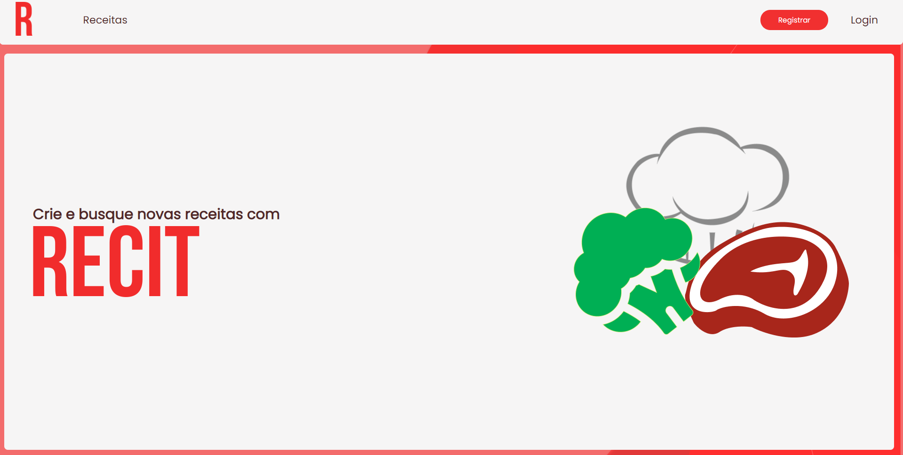

# RECEIT 

<p align="center">	
   
</p>
<p align="center">	
  Projeto desenvolvido como Trabalho de Conclusão de Curso na Fatec Jundiaí
  </p><p align="center">	
 Um lugar para armazenar suas melhores receitas
   </p>
  
## :computer: Tecnologias
Esse projeto foi desenvolvido utilizando as seguintes tecnologias:

* [Typescript][typescript-url]      
* [React][react-url]        
* [Express][express-url]
* [Postgres][postgres-url]
* [TyeORM][typeorm-url]

## :pencil: Funcionalidades

* Uma livro de receitas digital para  organizar seus pratos favoritos.
* Uma aplicação mobile para conectar alunos e professores.

## 📲 Como executar o projeto
```bash
# Clone o Repositório
$ git clone https://github.com/NicolasElena/receit.git
```
### 🛠 Requerimentos
* [Node.js][node-url]
* [Yarn][yarn-url] or [npm][npm-url]
* [Postgres][postgres-url]

### 📦 API

```bash
# Acesse a pasta server
$ cd Receit/server

# Instale as dependências do projeto
$ yarn install
# ou
$ npm i

# Inicie a API
$ yarn dev
# ou
$ npm run dev
```
Endereço da API: http://localhost:3333/

### 💻 Projeto Web

```bash
# Acesse a pasta web
$ cd Receit/web

# Instale as dependências do projeto
$ yarn install
# ou
$ npm i

# Execute a aplicação web
$ yarn start
# ou
$ npm run start
```
Endereço da aplicação web: http://localhost:3000/


## 📓 Licença
Esse projeto esta sobre [MIT license](./LICENSE).

⭐️Feito com carinho por [Nicolas Elena][nick-profile-url] e [Matheus Rodrigues][matt-profile-url].⭐️ 

<!-- VARS -->

[express-url]: https://expressjs.com/
[react-url]: https://reactjs.org/   
[nick-profile-url]: https://github.com/NicolasElena
[matt-profile-url]: https://github.com/Th3Matts
[node-url]: https://nodejs.org/en
[yarn-url]: https://classic.yarnpkg.com/
[npm-url]:  https://www.npmjs.com/
[expo-url]: https://expo.io/
[expo-url-mobile]: https://play.google.com/store/apps/details?id=host.exp.exponent
[typescript-url]: https://www.typescriptlang.org/ 
[typeorm-url]:  https://typeorm.io/#/
[postgres-url]: https://www.postgresql.org/

<!-- VARS -->

